  

  
  
  

---

<h1 align="center">🩺 Awesome Medical Scribe AI 🤖</h1>

  <strong>Curated List of SaaS Products &amp; Open-Source GitHub Projects</strong> 
  <em>Focused on Ambient Clinical Documentation, Real-Time Transcription, SOAP/Progress Note Generation, EHR Integration &amp; Physician Workflow Automation</em> 
  <strong>Last updated: August 2026</strong>

  
  
  
  
  

---

This repository tracks notable **SaaS platforms** and **open-source projects** for **Medical Scribe AI** (also called ambient clinical intelligence or AI scribes). These systems listen to clinician–patient conversations, transcribe the encounter, and automatically generate structured clinical notes (SOAP, progress notes, etc.) that can be reviewed and pushed into the EHR.

**Examples** include Abridge, Nabla, Suki, DeepScribe, Freed AI, Microsoft Dragon Copilot (Nuance DAX), Augmedix, Notable, Nuance DAX, and Heidi Health (the category leaders).

> **🔓 Open-source emphasis**: This section is heavily expanded with every major active project for local-first or self-hosted ambient scribes, note generation pipelines, and OpenEMR-integrated tools — ideal for privacy-conscious clinics, researchers, health systems, and developers seeking full data control and lower cost.

Contributions welcome! Open a PR to add/update entries. Keep descriptions factual and link to official sites.

## 📑 Table of Contents

- [🖥️ SaaS/Hosted Platforms](#saas-hosted-platforms)
- [💻 Open-Source GitHub Projects](#open-source-github-projects)
- [🤝 How to Contribute](#how-to-contribute)
- [⚠️ Disclaimer](#disclaimer)

---

## 🖥️ SaaS/Hosted Platforms

| Product | Description | 💰 Pricing (Starting) | 🆓 Free Tier / Trial | 🏢 Company Size |
|---|---|---|---|---|
| [Microsoft Dragon Copilot / Nuance DAX](https://www.microsoft.com/) | Enterprise ambient documentation solution (formerly Nuance DAX) with deep Epic and multi-EHR integration, backed by Microsoft. | $369–$830/provider/month (enterprise, custom quotes) | ❌ No free tier; proof-of-concept available on request | ~$19.7B (acquired by Microsoft in 2021) |
| [Abridge](https://www.abridge.com/) | Enterprise ambient AI documentation platform with strong evidence linking, deep EHR (especially Epic) integration, and large-scale health-system deployments. | ~$208/provider/month (enterprise contracts ~$2,500/yr) | ❌ No free tier; enterprise pilot available on request | $5.3B valuation (Series E, Jun 2025); ~$800M+ total funding |
| [Suki](https://www.suki.ai/) | Voice-first clinical assistant that combines ambient documentation with natural-language commands for EHR navigation and workflow automation. | $299/user/month (Suki Compose); $399/user/month (Suki Assistant) | ✅ Free tier: limited to 10 Pro Actions/month | $500M valuation (Series D, Oct 2024); $168M total funding |
| [Notable](https://www.notablehealth.com/) | Healthcare AI platform that includes ambient documentation and broader automation of clinical and administrative workflows. | Enterprise-only custom pricing (contact sales) | ❌ No public free tier; demo available on request | $600M valuation; $116M+ total funding |
| [Heidi Health](https://www.heidihealth.com/) | Flexible AI scribe with extensive template support, multi-language capabilities, and options suitable for individual clinicians and groups. | $40/user/month (Evidence Plus); $110/user/month (Clinician) | ✅ Free tier: unlimited basic consults + 10 Pro Actions/month | $465M valuation (Series B, Oct 2025); $96.6M total funding |
| [Nabla](https://www.nabla.com/) | Modern ambient scribe focused on speed, usability, and high-quality clinical notes with strong mobile and clinician-friendly workflows. | $119/provider/month (Pro plan) | ✅ Free tier: up to 30 encounters/month (unlimited for residents/interns) | ~$180M valuation (Series C, Jun 2025); $120M total funding |
| [DeepScribe](https://www.deepscribe.ai/) | Specialty-oriented ambient scribe strong in complex documentation (oncology, cardiology, etc.) with coding suggestions and longitudinal context. | ~$350–$750/provider/month (enterprise, custom quotes) | 🆓 20 free sessions for new users (trial) | ~$135M valuation (Series B); $60M total funding |
| [Augmedix](https://www.augmedix.com/) | Ambient medical documentation platform combining AI with human review options for high-accuracy clinical notes. | ~$1,200+/provider/month (enterprise, custom quotes) | ❌ No free tier; demo available on request | Acquired by Commure for $139M (2024); ~$52M TTM revenue |
| [Freed AI](https://www.getfreed.ai/) | Simple, clinician-friendly AI scribe popular with solo and small practices; emphasizes ease of use and transparent pricing. | $39/month (Starter, 40 notes); $79/month (Core, unlimited) | 🆓 7-day free trial (unlimited notes, no credit card) | $34M total funding (Series A, Mar 2025); ~$19M ARR |
| [Other notable platforms](https://) | Additional commercial offerings continue to emerge, often differentiating on specialty depth, pricing model, or specific EHR partnerships. | Varies | Varies | Varies |

---

## 💻 Open-Source GitHub Projects

| Repository | ⭐ Stars | Description |
|---|---|---|
| [maziyarpanahi/openmed](https://github.com/maziyarpanahi/openmed) |  | Local-first healthcare AI: clinical NER & HIPAA PII de-identification that runs 100% on-device. 2,200+ medical models, 21 clinical NLP tasks. |
| [stenolabs/stenoai](https://github.com/stenolabs/stenoai) |  | Privacy-first AI notepad for confidential conversations. Records, transcribes, summarizes, and queries meetings using local AI models. Useful for clinical encounters. |
| [sammargolis/OpenScribe](https://github.com/sammargolis/OpenScribe) |  | Open-source AI scribe that records patient encounters and generates structured clinical notes with local Whisper transcription and no vendor lock-in. |
| [bloodworks-io/phlox](https://github.com/bloodworks-io/phlox) |  | Open-source, local-first AI medical agent and ambient scribe with patient management, adaptive note generation, and fully private on-device operation. |
| [1984Doc/AI-Scribe](https://github.com/1984Doc/AI-Scribe) |  | Medical scribe capable of creating SOAP notes running Whisper and Kobold based on conversation with a patient. |
| [trevorpfiz/scribeHC](https://github.com/trevorpfiz/scribeHC) |  | Open-source AI ambient scribe app for healthcare that records patient-doctor conversations and automatically generates SOAP notes from transcripts. |
| [BirgerMoell/open-medical-scribe](https://github.com/BirgerMoell/open-medical-scribe) |  | Modular, privacy-first medical scribe with pluggable providers for transcription (Whisper, Deepgram) and note generation (OpenAI, Anthropic, Ollama). Supports SOAP, H&P, DAP notes. |
| [phairlab/berta-ai-scribe](https://github.com/phairlab/berta-ai-scribe) |  | Open-source modular platform for AI-enabled clinical documentation, successfully deployed at provincial scale with significant cost reduction versus commercial tools. |
| [ClinicianFOCUS/FreeScribe](https://github.com/ClinicianFOCUS/FreeScribe) |  | Medical scribe capable of creating SOAP notes running Whisper and Kobold based on conversation with a patient. Fork of 1984Doc/AI-Scribe. |
| [hutchpd/AI-Medical-Scribe](https://github.com/hutchpd/AI-Medical-Scribe) |  | Browser-based prototype for live consultation transcription, on-device summarisation, document drafting, structured extraction, and FHIR export. |
| [lukehollis/open-healthcare-ai-scribe](https://github.com/lukehollis/open-healthcare-ai-scribe) |  | Open-source healthcare AI scribe for real-time medical documentation and clinical templates across text and voice. |
| [NVIDIA-AI-Blueprints/ambient-provider](https://github.com/NVIDIA-AI-Blueprints/ambient-provider) |  | NVIDIA reference blueprint for building ambient AI provider documentation workflows using local or cloud speech-to-text and LLM pipelines. |
| [iupui-soic/openemr-ai](https://github.com/iupui-soic/openemr-ai) |  | Artificial intelligence tooling for OpenEMR focused on ambient listening, note summarization, and automated coding with FHIR write-back. |
| [AAC-Open-Source-Pool/AI-MEDICAL-SCRIBE](https://github.com/AAC-Open-Source-Pool/AI-MEDICAL-SCRIBE) |  | Intelligent Python-based application designed to automate clinical documentation using advanced speech recognition and natural language processing. |

### 🔧 Additional Strong Open-Source Components

- **🎙️ ASR Engines**: [Faster-Whisper](https://github.com/SYSTRAN/faster-whisper), [whisper.cpp](https://github.com/ggerganov/whisper.cpp), and other high-performance open ASR engines fine-tuned or prompted for clinical audio.
- **🧠 Medical NLP**: Open medical LLMs and RAG pipelines over clinical guidelines or local knowledge bases.
- **🔗 EHR Integration**: FHIR clients and SMART-on-FHIR apps that enable secure note write-back into open or commercial EHRs.
- **📝 Note Templates**: Template engines and prompt libraries specifically designed for SOAP, H&P, and progress notes.
- **🎤 Recording Front-Ends**: Desktop and mobile recording front-ends that keep audio processing under user control.

> **🏗️ Frameworks for building custom systems**: Capture audio locally or via a controlled stream, transcribe with **Whisper**-family models (on-device or private cloud), structure the transcript into clinical notes using a local or private LLM (optionally with RAG over specialty templates), present a review UI, and write approved notes back via FHIR or direct EHR integration. Projects such as **OpenScribe**, **Phlox**, and **Open Medical Scribe** provide ready starting points. Prioritize audit logging, consent capture, and data minimization for compliance.

---

## 🤝 How to Contribute

1. 🍴 Fork the repo.
2. ✏️ Add/edit entries in `README.md` (follow existing format).
3. 📋 Include: name, link, 1–2 sentence description, and whether it's SaaS or open-source.
4. 📨 Submit PR with a short explanation.

⭐ Star the repo if you find it useful!

---

## ⚠️ Disclaimer

- This is a **community-curated** list — not exhaustive and not an endorsement.
- 🏥 Medical documentation is a regulated, high-stakes activity. Ambient AI scribes process protected health information (PHI). Open-source tools can offer excellent privacy and cost advantages but require rigorous validation, clinical oversight, security hardening, and compliance with HIPAA, GDPR, or equivalent regulations before any clinical use.
- 👨‍⚕️ Generated notes must always be reviewed and approved by a licensed clinician. These systems assist documentation; they do not replace clinical judgment.

---

  <strong>🩺 Made for clinicians, health-system IT teams, and open-source health-tech developers. 🚀</strong> 
  Let's make high-quality clinical documentation more accessible, private, and clinician-controlled.

